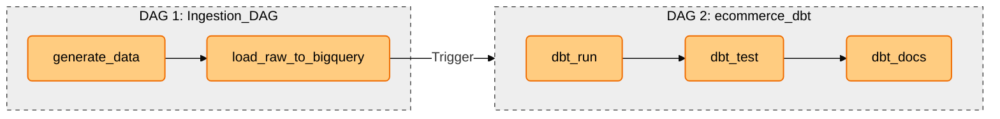
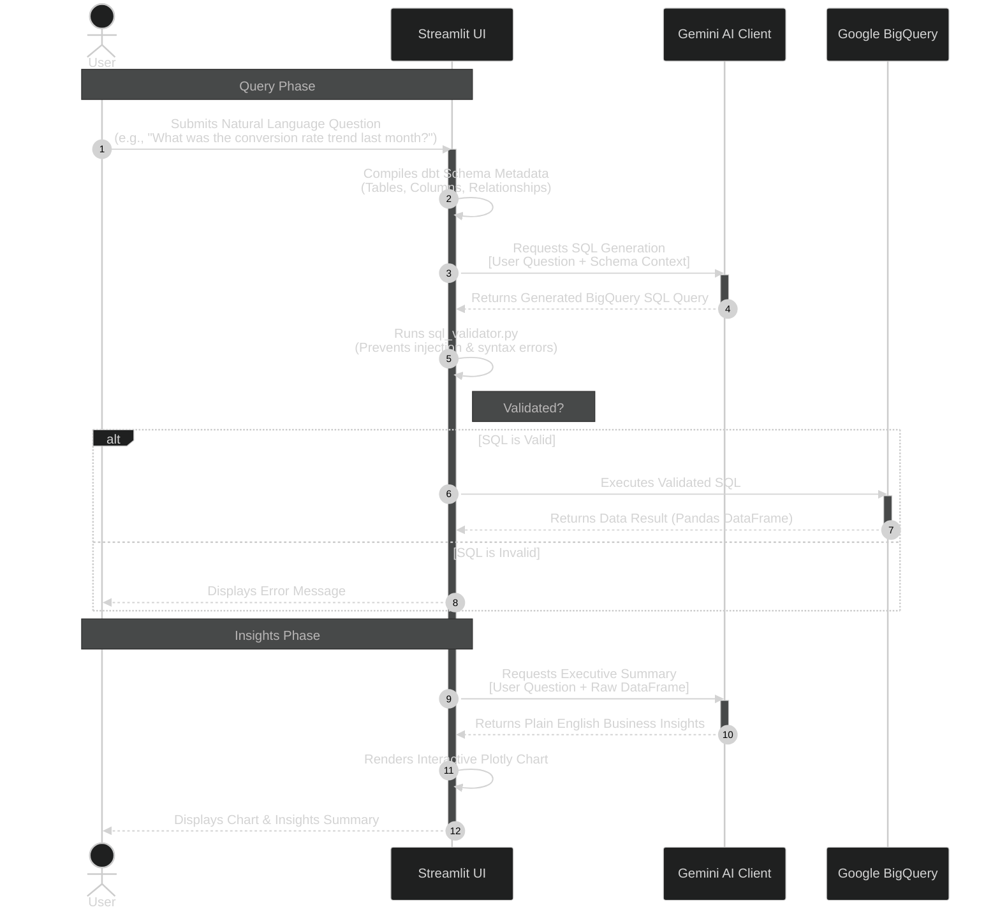

# 📊 GenAI-Powered Cloud Analytics Copilot for E-Commerce Data Warehousing

[](https://www.python.org/)
[](https://cloud.google.com/bigquery)
[](https://www.getdbt.com/)
[](https://airflow.apache.org/)
[](https://streamlit.io/)
[](https://deepmind.google/technologies/gemini/)

An end-to-end modern data stack (MDS) analytics platform and AI assistant. This system automates ingestion of large scale e-commerce datasets into Google BigQuery, builds structured star-schema and metrics tables using dbt core, serves an executive-ready business intelligence dashboard with custom machine learning models (churn prediction), and embeds a schema-grounded natural language SQL copilot using the Gemini API.

---

## 🏗️ Architecture Overview

```mermaid
%%{init: {'theme': 'base', 'themeVariables': { 'primaryColor': '#2a2a2a', 'edgeLabelBackground':'#ffffff', 'tertiaryColor': '#fff'}}}%%
graph LR
    %% Main Components
    subgraph INGEST ["1. Data Ingestion (Python)"]
        direction TB
        Faker[Python Faker Script]
        RawCSV[Raw CSV Files]
        IngestScript[load_to_bigquery.py]
    end

    subgraph DWH ["2. Data Warehouse (Google BigQuery)"]
        direction TB
        
        subgraph RawSchema ["raw schema"]
            R_Ord[orders]
            R_Cust[customers]
            R_Prod[products]
            R_Item[order_items]
            R_Ev[events]
            R_Ret[returns]
            R_Mkt[marketing_spend]
        end

        subgraph dbt_T ["dbt Transformation Layers"]
            Staging[dbt Staging Layer:<br/>Type Casting & Validation]
            Intermediate[dbt Intermediate Layer:<br/>RFM Metrics, Churn Features]
            Marts[dbt Marts Layer:<br/>fact_orders, dim_customers, dim_products]
        end
        
        subgraph MetricsLayer ["Metrics Layer"]
            M_Rev[revenue_daily]
            M_Perf[product_performance]
            M_LTV[customer_ltv]
        end
    end

    subgraph SERVING ["3. Serving & Analytics Layer"]
        direction TB
        subgraph APPS ["Applications"]
            Streamlit[Streamlit Application:<br/>Interactive BI Tabs]
        end
        
        subgraph AI_ML ["AI & Machine Learning"]
            SKLearn[scikit-learn Churn Model:<br/>Logistic Regression]
            Gemini[AI Analytics Copilot:<br/>Schema-grounded Gemini API]
        end
    end

    %% Flow Connections
    Faker -->|Simulates Data| RawCSV
    RawCSV -->|Read by| IngestScript
    IngestScript -->|Load (WRITE_TRUNCATE)| RawSchema

    %% dbt Internal Flow
    RawSchema --> Staging
    Staging --> Intermediate
    Intermediate --> Marts
    Marts --> MetricsLayer

    %% Serving Connections
    Marts -.->|Query| Streamlit
    MetricsLayer -.->|Query| Streamlit
    Intermediate -.->|Input Features| SKLearn
    Marts -.->|Grounding Context| Gemini
    SKLearn -->|Churn Probabilities| Streamlit
    Gemini <-->|Interactive Querying| Streamlit

    %% Styling classes
    classDef ingestion fill:#a5d6a7,stroke:#2e7d32,stroke-width:1px,color:black;
    classDef storage fill:#e0e0e0,stroke:#616161,stroke-width:1px,color:black;
    classDef dbt fill:#ffcc80,stroke:#ef6c00,stroke-width:1px,color:black;
    classDef serving fill:#90caf9,stroke:#1565c0,stroke-width:1px,color:black;

    %% Apply styles
    class Faker,RawCSV,IngestScript ingestion;
    class R_Ord,R_Cust,R_Prod,R_Item,R_Ev,R_Ret,R_Mkt storage;
    class Staging,Intermediate,Marts,MetricsLayer dbt;
    class Streamlit,SKLearn,Gemini serving;
```

### ⏱️ Airflow & dbt Orchestration Flow


---

## 🛠️ Tech Stack & Roles

| Component | Technology | Purpose |
|---|---|---|
| **Data Generation** | Python (`Faker`) | Simulates realistic e-commerce operational logs |
| **Ingestion** | Python (`google-cloud-bigquery`) | Batch imports files directly into BigQuery `raw` dataset |
| **Orchestration** | Apache Airflow | Schedules daily ingestion and dbt runs via DAG pipelines |
| **Data Warehouse** | Google BigQuery | Highly scalable serverless warehouse |
| **Data Modeling** | dbt (Data Build Tool) | Implements staging, intermediate modeling, star schema, and aggregations |
| **Machine Learning** | Python (`scikit-learn`) | Logistic Regression model predicting customer churn |
| **Visualizations** | Plotly & Streamlit | Displays analytical metrics and interactive charts |
| **Generative AI** | Gemini 1.5 Pro (Google GenAI) | Schema-grounded SQL generation and data explanation |

---

## 📂 Project Repository Structure

```
├── .env.example                      # Template for GCP and directory configurations
├── requirements.txt                  # Python dependencies
├── README.md                         # Project documentation
│
├── bigquery/
│   └── setup_datasets.py             # Provisioning script for BigQuery schemas
│
├── loaders/
│   ├── load_to_bigquery.py           # Ingestion logic to stream CSVs → BigQuery
│   └── setup_datasets.py             # Setup script helper
│
├── airflow/
│   └── dags/
│       ├── ingestion_dag.py          # Schedules raw data sync
│       └── dbt_dag.py                # Runs dbt transformation sequences
│
├── dbt/                              # dbt project configurations
│   ├── dbt_packages/
│   ├── logs/
│   │   └── dbt.log
│   ├── macros/
│   │   ├── generate_schema_name.sql
│   │   └── safe_divide.sql
│   ├── seeds/
│   ├── target/
│   ├── tests/
│   ├── .user.yml
│   ├── dbt_project.yml
│   ├── profiles.yml
│   ├── packages.yml                  # Third-party utilities (dbt_utils)
│   └── models/
│       ├── staging/
│       │   ├── _sources.yml          # Layer 1: Schema alignment and cleaning
│       │   ├── stg_customers.sql
│       │   ├── stg_events.sql
│       │   ├── stg_marketing_spend.sql
│       │   ├── stg_order_items.sql
│       │   ├── stg_orders.sql
│       │   ├── stg_products.sql
│       │   └── stg_returns.sql
│       ├── intermediate/             # Layer 2: RFM scoring, churn feature compilation
│       └── marts/
│           ├── core/                 # Star schema (fact_orders, dim_customers, dim_products)
│           └── metrics/              # Structured aggregations for dashboard queries
│
└── streamlit/                        # Application frontend
    ├── app.py                        # Main Multi-tab Streamlit dashboard
    ├── components/
    │   ├── charts.py                 # Plotly configurations for business KPIs
    │   └── kpi_cards.py              # Custom indicators for executive summaries
    ├── utils/
    │   ├── bq_client.py              # BigQuery connection wrapper (caching enabled)
    │   ├── queries.py                # SQL library for business intelligence tabs
    │   └── churn_model.py            # Logistic regression training and inference
    └── ai/                           # AI Copilot engine
        ├── gemini_client.py          # Gemini API wrapper
        ├── schema_context.py         # Pulls schema definitions from dbt
        ├── ai_sql_generator.py       # Direct question-to-SQL translation
        ├── ai_sql_validator.py       # SQL validator (protects against runtime errors)
        └── insight_generator.py      # Generates executive-ready analysis
```

---

## 🚀 Getting Started

### 📋 Prerequisites
- Python **3.11+** installed
- A Google Cloud Platform (GCP) project with the **BigQuery API** enabled
- A service account credentials JSON file with `BigQuery Admin` permissions

### 1️⃣ Installation & Virtual Environment Setup
Clone the repository and install the requirements:
```bash
git clone <repository_url>
cd ecommerce-analytics
python -m venv venv
venv\Scripts\activate   # Mac/Linux: source venv/bin/activate
pip install -r requirements.txt
```

### 2️⃣ Environment Configuration
Create a `.env` file from the template and configure your paths:
```bash
copy .env.example .env   # Mac/Linux: cp .env.example .env
# Edit .env with your GCP project details and service account JSON path
```

### 3️⃣ Ingest and Model Data
1. Generate data:
   ```bash
   python data/generate_data.py
   ```
2. Provision BigQuery datasets and load raw tables:
   ```bash
   python loaders/setup_datasets.py
   python loaders/load_to_bigquery.py
   ```
3. Run the dbt transformation pipeline:
   ```bash
   cd dbt
   dbt deps
   dbt run
   dbt test
   cd ..
   ```

### 4️⃣ Start Streamlit Analytics Dashboard
Run the dashboard interface locally:
```bash
cd streamlit
streamlit run app.py
```
- Open `http://localhost:8501` to access the dashboard tabs and the **AI Copilot**!

---

## 💡 Key Features Implemented

### 1. Multi-Tab Executive Dashboard
- **Overview**: Real-time sales velocity, revenue trends, and acquisition channel breakdowns.
- **Products & Margins**: Dynamic categorization showing the top-performing inventory alongside unit profitability.
- **Customers**: RFM (Recency, Frequency, Monetary) segmentation maps client bases into categories like *Champions* and *At Risk*.
- **Returns**: Outlines refund trends, returns rates, and identifies high-risk products.
- **Marketing Performance**: Live CAC, Spend, Revenue, and ROAS trend lines per acquisition channel.
- **Funnel**: Interactive clickstream visualizer tracking user drop-offs from homepages to final checkouts.

### 2. Predictive Churn Modeling (Machine Learning Integration)
- **Feature Engineering**: Standardized dbt models compute order frequency in the last 30 days, average order value trends, and days since last purchase.
- **Model Training**: A `scikit-learn` Logistic Regression model with feature scaling (`StandardScaler`) is trained with a historical snapshot (using a 90-day cutoff to prevent data leakage).
- **Interactive Classification**: Assigns real-time, quantile-based risk probabilities, sorting customers into *Low*, *Medium*, and *High* risk categories.
- **Executive Metrics**: Summarizes total at-risk Lifetime Value (LTV) and lists the top 25 high-risk profiles directly in the Customers dashboard tab.

### 3. Schema-Grounded AI Analytics Copilot
- **Plain English to SQL**: Translate complex analytical requests (e.g., *"Which marketing channel had the best ROAS last month?"*) into BigQuery SQL.
- **Context Injection**: Reads dbt schemas and model descriptions dynamically so the LLM is fully grounded in the database structure.
- **Visual & Insight Generation**: Executes queries on BigQuery, renders tabular outputs, selects appropriate Plotly configurations (lines/bars) based on query schemas, and uses Gemini to summarize key takeaways.

#### 🤖 AI Copilot Query Execution Sequence

